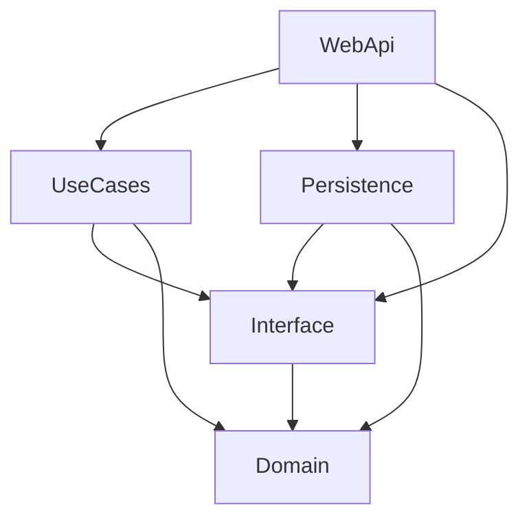
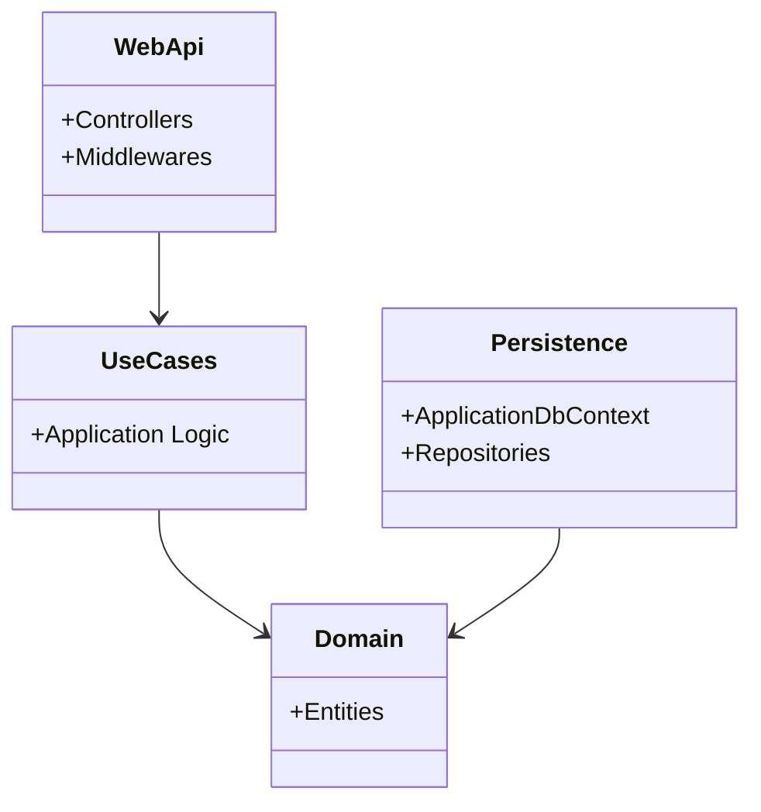

# 01 Architecture

## Clean Architecture
El proyecto sigue los principios de Clean Architecture, separando las responsabilidades en capas concéntricas donde las dependencias siempre apuntan hacia el interior (el Dominio).

## Responsabilidades por Capa
- **Domain:** Contiene la lógica pura de negocio, Entidades (Ej. `Pedido`, `Mesa`), Objetos de Valor e interfaces muy básicas. No depende de ninguna otra capa.
- **Interface:** Define los contratos (puertos) que el resto de capas deben implementar, por ejemplo `IRepository`, `IUnitOfWork`.
- **UseCases:** Contiene la lógica de la aplicación. Orquesta llamadas a los repositorios definidos en `Interface` y manipula entidades del `Domain`.
- **Persistence:** Implementa los repositorios (adaptadores) y el DbContext de EF Core. Conoce sobre PostgreSQL.
- **WebApi:** Es el punto de entrada (Controladores REST). Transforma peticiones HTTP en llamadas a `UseCases` y retorna `DTOs`.
- **Validator & DTO:** Proveen las reglas de validación de entrada y la estructura de los datos que entran y salen.

## Patrones Utilizados

### Repository Pattern & Unit Of Work
Se utiliza un enfoque de repositorios genéricos y específicos, junto con un `UnitOfWork`.
- **Scrutor** auto-registra cualquier clase terminada en `Repository`.
- **`IGenericRepository<>`**: Utilizado primariamente para catálogos simples (`Cat*`).
- **`IUnitOfWork`**: Centraliza el guardado en la base de datos (`SaveChanges`).

### Dependency Injection (DI)
El proyecto usa el contenedor de DI nativo de .NET.
La capa `Persistence` usa `ConfigureServices.cs` para inyectar su propio DbContext y usar *assembly scanning* (Scrutor) para registrar repositorios. `WebApi` hace lo mismo en `Program.cs` (`AddApplicationServices`, `AddFeature`, etc.).

### Result Pattern
Aunque no lo vemos explícitamente sin profundizar en UseCases, típicamente la capa de UseCases retorna un objeto `Result<T>` para manejar errores de dominio sin lanzar excepciones.

### AutoMapper & FluentValidation
Los `DTOs` se mapean a entidades (probablemente con AutoMapper o mapping manual). `FluentValidation` valida los requests antes de que lleguen a los UseCases.

