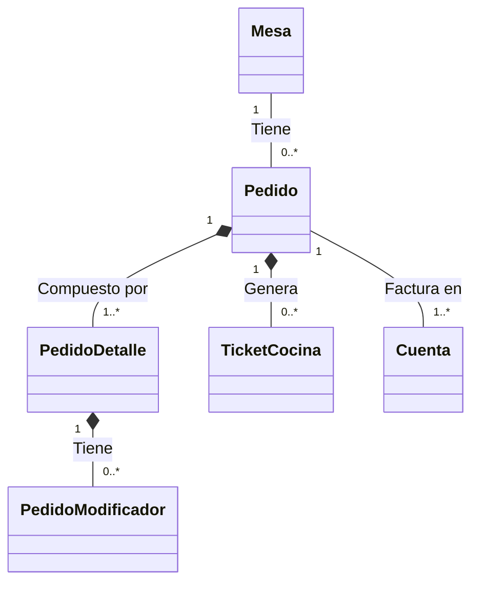

# 09 Domain Model

El dominio se estructura en distintos "Agregados" (Aggregates) según los principios de DDD (Domain-Driven Design). Cada agregado tiene una Raíz (Aggregate Root) que garantiza la consistencia interna.

## Agregado: Organización y Accesos
- **Entidades:** `Empresa`, `Sucursal`, `Area`.
- **Relaciones:** Una Empresa tiene N Sucursales. Una Sucursal tiene N Áreas.
- **Flujos:** Se usan para delimitar la información. Un usuario (o cajero) opera dentro de una sucursal.

## Agregado: Catálogo de Productos (Menú)
- **Raíz del Agregado:** `Producto` / `CategoriaMenu`.
- **Entidades:** `Menu`, `CategoriaMenu`, `Producto`, `VarianteProducto`, `Precio`.
- **Modificadores:** `GrupoModificador`, `OpcionModificador`.
- **Dependencias:** Todo producto pertenece a un menú/categoría. Modificadores alteran el comportamiento/precio final de un producto al momento de pedirlo.

## Agregado Transaccional: Pedido
- **Raíz del Agregado:** `Pedido`.
- **Hijos del Agregado:** `PedidoAsiento`, `PedidoDetalle`, `PedidoModificador`, `EventoPedido`, `TicketCocina`.
- **Relaciones:** Un `Pedido` se asigna a una `Mesa` (si es local) o `Cliente`. Cada `PedidoDetalle` proviene de un `Producto` y puede tener `PedidoModificador`es asociados.
- **Flujos y Estados:** 
  - Transición de estado (`CatEstadoPedido`) desde Creado, En Preparación, Servido, Pagado.
  - Generación de auditoría transaccional vía `EventoPedido`.
  - Disparo de eventos hacia la cocina (`TicketCocina`).

## Agregado: Financiero (Cuenta y Pago)
- **Raíz del Agregado:** `Cuenta`.
- **Entidades:** `Cuenta`, `DetalleCuenta`, `Pago`, `DescuentoAplicado`, `Turno`, `CorteCaja`.
- **Flujos:** Un `Pedido` puede separarse en varias `Cuenta`s. Una `Cuenta` agrupa lo que se debe cobrar y se liquida mediante `Pago`s (usando `CatMetodoDePago`). El flujo diario se gestiona dentro de un `Turno`.

